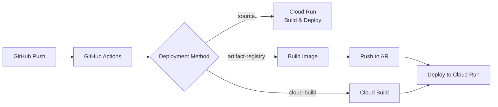

# Setup Guide

Complete setup guide for deploying jplaw2epub Web API to Google Cloud Run.

## 📋 Prerequisites

- Google Cloud Project created
- `gcloud` CLI installed
- GitHub account
- Appropriate project permissions

## 🚀 Quick Start

### 1. Set Environment Variables

```bash
export PROJECT_ID="your-gcp-project-id"
export GITHUB_ORG="your-github-username"  # e.g. ngs
export GITHUB_REPO="jplaw2epub-web-api"
export REGION="asia-northeast1"
```

### 2. Setup Workload Identity Federation

Configure secure authentication from GitHub Actions to GCP:

```bash
# Grant execute permission to script
chmod +x scripts/setup-workload-identity.sh

# Run setup
./scripts/setup-workload-identity.sh
```

Add the following values output by the script to GitHub secrets:
- `WIF_PROVIDER`
- `WIF_SERVICE_ACCOUNT`
- `PROJECT_ID`

### 3. Setup Artifact Registry

Create a repository for storing Docker images:

```bash
# Grant execute permission to script
chmod +x scripts/setup-artifact-registry.sh

# Run setup
./scripts/setup-artifact-registry.sh
```

### 4. Configure GitHub Secrets

Add the following in GitHub repository Settings → Secrets and variables → Actions:

| Secret Name | Value | Description |
|------------|-------|-------------|
| `PROJECT_ID` | your-project-id | GCP Project ID |
| `WIF_PROVIDER` | projects/... | Workload Identity Provider |
| `WIF_SERVICE_ACCOUNT` | github-actions-sa@... | Service Account |

## 📦 Deployment Methods

### Automatic Deployment (Recommended)

Automatically deploys on push to main/master branch:

```bash
git push origin main
```

### Manual Deployment

Deploy manually from GitHub Actions UI:

1. Open Actions tab in GitHub repository
2. Select "Deploy to Cloud Run" workflow
3. Click "Run workflow"
4. Select deployment method:
   - `source`: Deploy directly from source code (default, simplest)
   - `artifact-registry`: Via Artifact Registry
   - `cloud-build`: Via Cloud Build

### Command Line Deployment

#### Option 1: Deploy from Source (Simplest)

```bash
gcloud run deploy jplaw2epub-api \
  --source . \
  --region=asia-northeast1 \
  --allow-unauthenticated
```

#### Option 2: Via Cloud Build

```bash
gcloud builds submit \
  --config=cloudbuild.yaml \
  --region=asia-northeast1
```

## 🌐 Custom Domain Setup (Optional)

To use a custom domain:

```bash
# Set environment variables
export DOMAIN="api.yourdomain.com"

# Run setup script
chmod +x scripts/setup-custom-domain.sh
./scripts/setup-custom-domain.sh

# After configuring DNS records, run verification
./scripts/verify-custom-domain.sh
```

## 🏗️ Architecture

### Deployment Flow



### GCP Services Used

- **Cloud Run**: Application hosting
- **Artifact Registry**: Docker image storage
- **Cloud Build**: Container building
- **IAM & Workload Identity**: Authentication and authorization

## 🔧 Configuration Files

### .github/workflows/deploy.yml

Unified deployment workflow supporting three deployment methods:
- Direct deployment from source (default)
- Via Artifact Registry
- Via Cloud Build

### cloudbuild.yaml

Cloud Build configuration file. Uses Artifact Registry to build, push, and deploy images.

### scripts/

- `setup-workload-identity.sh`: Setup WIF authentication
- `setup-artifact-registry.sh`: Setup Docker registry
- `setup-custom-domain.sh`: Configure custom domain
- `verify-custom-domain.sh`: Verify domain configuration

## 📊 Monitoring

### View Logs

```bash
# Cloud Run logs
gcloud run services logs jplaw2epub-api --region=asia-northeast1

# Cloud Build logs
gcloud builds list --limit=5
gcloud builds log [BUILD_ID]
```

### Check Metrics

```bash
# Service status
gcloud run services describe jplaw2epub-api --region=asia-northeast1

# List revisions
gcloud run revisions list --service=jplaw2epub-api --region=asia-northeast1
```

## 🐛 Troubleshooting

### Common Issues and Solutions

#### 1. "Repository not found" Error

```bash
# Create Artifact Registry repository
./scripts/setup-artifact-registry.sh
```

#### 2. Authentication Error

```bash
# Reconfigure WIF
./scripts/setup-workload-identity.sh

# Check permissions
gcloud projects get-iam-policy $PROJECT_ID
```

#### 3. Deployment Failure

```bash
# Check Cloud Build logs
gcloud builds list --limit=1
gcloud builds log [BUILD_ID]

# Check service events
gcloud run services describe jplaw2epub-api \
  --region=asia-northeast1 \
  --format="value(status.conditions[].message)"
```

### Rollback

```bash
# Rollback to previous revision
gcloud run services update-traffic jplaw2epub-api \
  --to-revisions=jplaw2epub-api-00001-xxx=100 \
  --region=asia-northeast1
```

## 💰 Cost Optimization

### Development Environment

```yaml
--min-instances=0  # Allow cold starts
--max-instances=3  # Limit concurrency
--cpu=1            # Minimum CPU
--memory=512Mi     # Minimum memory
```

### Production Environment

```yaml
--min-instances=1   # Always keep 1 instance running
--max-instances=10  # Scale limit
--cpu=2            # Adequate CPU
--memory=1Gi       # Adequate memory
```

## 🔒 Security

### Best Practices

1. **Use Workload Identity Federation** - No service account keys
2. **Principle of Least Privilege** - Minimal IAM roles
3. **Binary Authorization** - Enable for production
4. **Vulnerability Scanning** - Automatic in Artifact Registry
5. **Secret Management** - Consider using Secret Manager

### IAM Roles

Minimum required roles:
- `roles/run.developer`: Deploy to Cloud Run
- `roles/artifactregistry.writer`: Push images
- `roles/iam.serviceAccountUser`: Use service account

## 📚 Related Documentation

- [WORKLOAD_IDENTITY_SETUP.md](WORKLOAD_IDENTITY_SETUP.md) - WIF detailed setup
- [CUSTOM_DOMAIN_SETUP.md](CUSTOM_DOMAIN_SETUP.md) - Custom domain setup
- [DEPLOYMENT_OPTIONS.md](DEPLOYMENT_OPTIONS.md) - Deployment options details

## 🆘 Support

If you encounter issues:

1. Check [Troubleshooting](#-troubleshooting)
2. Refer to Cloud Run [official documentation](https://cloud.google.com/run/docs)
3. Create an issue on GitHub

## 📝 Next Steps

1. ✅ Basic setup complete
2. 🔄 Configure CI/CD pipeline
3. 🌐 Setup custom domain
4. 📊 Configure monitoring and alerts
5. 🔒 Enhance security